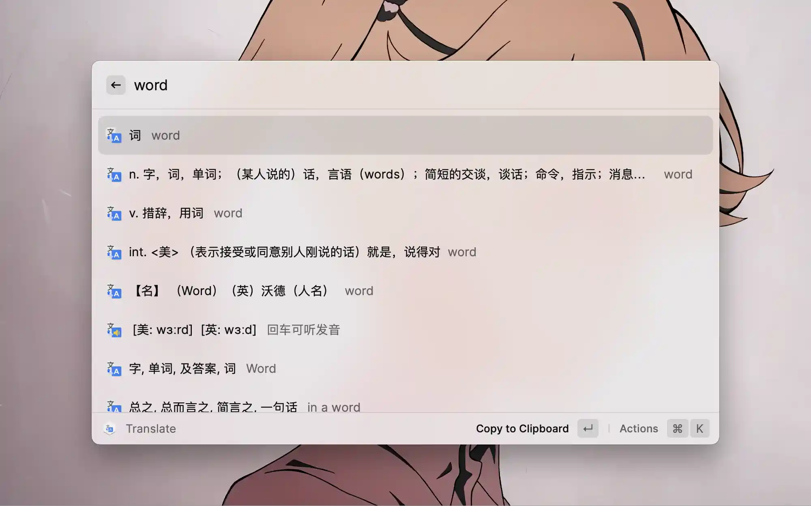

<p align="center">
  
  <h1 align="center">LingoCaster</h1>
</p>

English | [简体中文](./README.zh-CN.md)

Elegant Chinese ⇄ English translation and dictionary lookup for [Raycast](https://www.raycast.com), powered by [Youdao AI Cloud](https://ai.youdao.com).

The interaction is modeled on the beloved Alfred workflow [YoudaoTranslator](https://github.com/wensonsmith/YoudaoTranslator) — fast, keyboard-first, and tuned for the daily habits of Chinese users.

Compared with the [Raycast Easydict](https://github.com/tisfeng/Raycast-Easydict) extension, it responds faster and its interaction matches Chinese users' habits more closely.



## Features

- Instant translation between Chinese and English with dictionary details: phonetics, parts of speech, and web phrases
- Translate the selected text (or clipboard text as fallback) with one shortcut
- Pronounce any result with the built-in macOS voice
- Automatic word splitting for `CamelCase` / `snake_case` / `kebab-case` queries
- Long sentences automatically expand into a detail view
- Type `*` to browse your query history

## Setup

LingoCaster calls the Youdao text-translation API with your own credentials, so you need a (free) Youdao AI Cloud application:

1. Sign up at [Youdao AI Cloud (有道智云)](https://ai.youdao.com) and open the console
2. Create an application with the **Text Translation (自然语言翻译)** service enabled
3. Copy the application's `应用ID` and `应用秘钥`
4. On first launch, Raycast asks for the extension preferences — paste them as:
   - **App Auth Key** ← `应用ID`
   - **App Secret Key** ← `应用秘钥`

## Usage

| Shortcut | Action |
| --- | --- |
| `⌘` + `Space` _(customizable)_ | Open the `Translate` command input |
| double `⌥` _(customizable)_ | Run `Translate Selection` on the selected / clipboard text |
| `↩︎` on a result | Copy the translation and close Raycast |
| `⌘` + `↩︎` on a result | Pronounce it with the local voice |
| `⇧` + `↩︎` on a result | Open the result on Youdao web |
| `↩︎` on the phonetic row | Pronounce the head word |

> Pronunciation always targets the English side: for `Chinese → English` it reads the English result, for `English → Chinese` it reads the English input.

## Development

Requires macOS with [Raycast](https://www.raycast.com), and [Node.js](https://nodejs.org) ≥ 20.

```bash
git clone https://github.com/zthxxx/LingoCaster.git
cd LingoCaster

npm install
npm run dev     # build + hot-reload install into Raycast (`ray develop`)
```

Other scripts:

```bash
npm run build      # bundle the extension into dist/
npm run lint       # ray lint (eslint + prettier + manifest checks)
npm run test       # vitest unit tests
npm run typecheck  # tsc --noEmit
```

> The Youdao network integration test reads credentials from a local `.env.test`
> file (`APP_PLATFORM` / `APP_KEY` / `APP_SECRET`, never committed) instead of
> Raycast preferences, and skips itself automatically when they are absent.

## Credits

- [Alfred YoudaoTranslator](https://github.com/wensonsmith/YoudaoTranslator)
- [Raycast Easy Dictionary](https://github.com/tisfeng/Raycast-Easydict)
